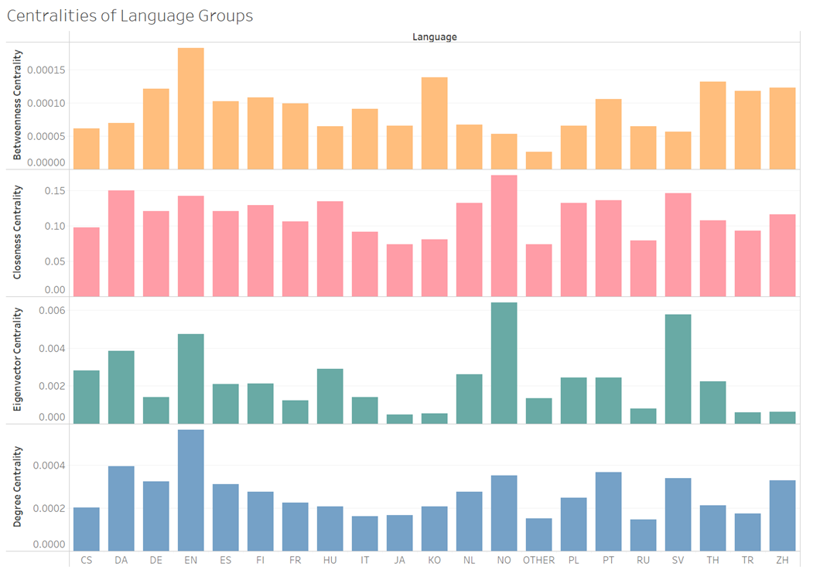
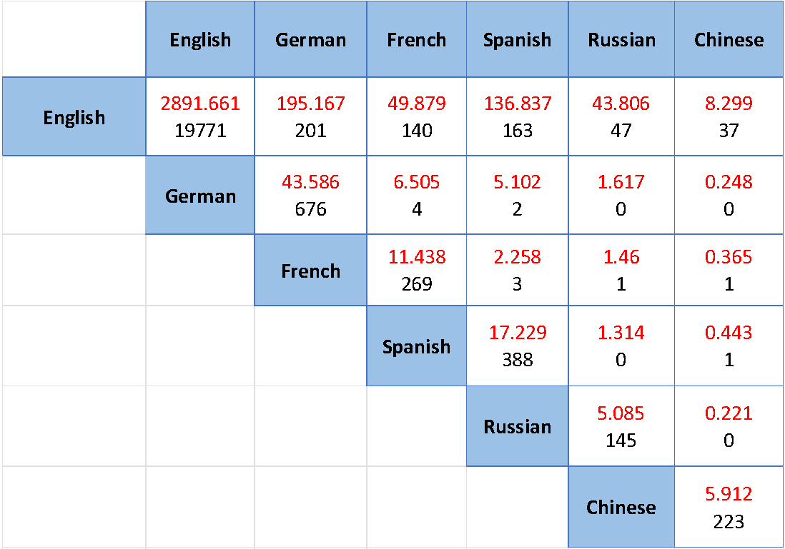
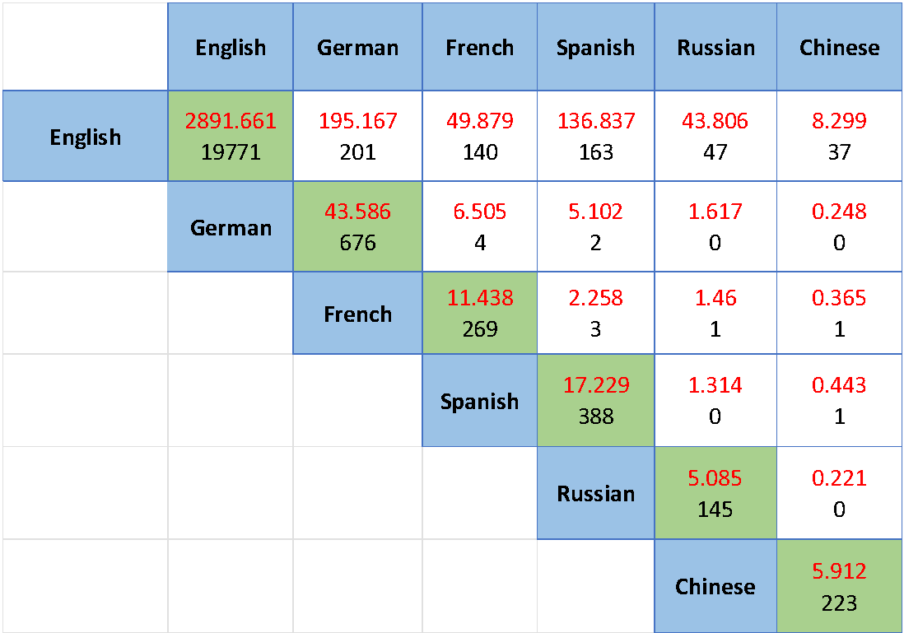

# Twitch Streamers Social Network

In this research I tried to see if language barriers affect the structure of a social network comprising of different Twitch streamers and their following relationships, so let's dive in!

# About The Network
The social network was built from a dataset of Twitch users that was collected from Twitch's public API in the Spring of 2018. Nodes are Twitch users and edges are mutual follower relationships between them.
The dataset can be found at the following link:
https://snap.stanford.edu/data/twitch_gamers.html

# Data Preparation
The original dataset contained around 168K Nodes and 6.8M 
Edges and looked something like this:

6% of the Nodes and 0.3% of the Edges were kept, making sure to maintain the ratio of languages spoken and ending up with a network consisting of 10k Nodes and 24k Edges.

I used partial data due to hardware restrictions.
Data sampling was done using SQL, each time only keeping 10k nodes and seeing how many edges are left, the largest number of edges I managed to keep while maintaining the same graph density was 24k.
Understandably this might affect the results; therefore, it's recommended for future research to work with the entire dataset.

# The Data
Nodes Table

Edges Table

# The Graph
Using Gephi, we’re able to observe that users who speak the same language seem to cluster together

# Some statistics regarding the network

# Research Question
Do language barriers affect the structure of social networks?

This research question aims to investigate whether language barriers have an impact on how people form connections in social networks. Specifically, it seeks to determine whether people who speak different languages are less likely to form connections with each other than those who speak the same language. 

# Methodology

In order to know if language barriers influence the network’s structure, we need to compare the actual number of edges between different language speakers with the expected number of edges in the network.

To do so, we use the Stochastic Block Model algorithm, which generates a graph with a specific community structure, where nodes within the same community are more likely to be connected than nodes in different communities.

The grouping generated by the Stochastic Block Model is based on maximizing the modularity of the network, which means that nodes within the same group have a higher probability of being connected to each other compared to nodes in different groups. 

The grouping is based on the assumption that nodes with similar properties (in this case, language) are more likely to be connected to each other.

The expected number of edges is calculated by multiplying the number of nodes in each language group and the probability of an edge forming between them, which is based on the density of the graph.

For the calculations, I created a function that receives two languages and predicts the number of edges between the two language groups in a graph, then prints the expected and actual number of edges between the two language groups.

# Results

The number in red is the expected number of edges between nodes speaking these languages, while the number in black is the actual number of edges in the graph.

The English language is spoken in most countries around the world, we can see in all cases the number of actual edges is higher than the expected number, which emphasizes the importance and popularity of English.

In the case of edges between Chinese-English and French-English streamers, the number of actual edges is significantly higher than expected. This could indicate that French or Chinese-speaking users are more likely to follow English-speaking users or vice versa, perhaps due to shared interests or content.
Another cause might be a large number of Chinese-speaking immigrants in the United States, as for French-English, many people from countries who have been under French and British colonization such as Canada and India can speak both languages fluently.

For people who speak Russian and German, The number of expected edges is always higher than the actual number (other than in the case of English which we explained earlier) this suggests that there are fewer users who speak German or Russian as an additional language.
Another reason might be that Russian and German speakers do not tend to follow streamers who speak a different language than them and vice versa, this may be due to the difficulty of these languages, or cultural differences in general, where people from Russia or Germany have more niche interests that are culture-specific.

The number of actual edges between users who speak the same language is significantly higher than expected for all the languages we checked. 
This indicates that there is a strong tendency for people who speak the same language to form relationships with each other.
This might stem from a variety of factors such as sharing common cultural values, beliefs, practices, and norms, shared interests in general, or greater ease of communication, where they don’t have to make an extra effort to understand what the other person is saying.

# Findings
Based on the results, it appears that language barriers do have an impact on the structure of social networks.

The number of edges between nodes speaking different languages is generally lower than the expected number of edges, while the number of edges between nodes speaking the same language is generally and significantly higher than the expected number of edges. 

Findings suggest that people tend to form connections with others who speak the same language and that language barriers may limit the formation of connections across language groups. 

It’s important to note that this analysis is limited to this specific dataset, further research is needed to make more general conclusions about the impact of language barriers on social network structure.

Thank you for taking the time to read through the research, please free to contact me with any questions or comments you have :D
